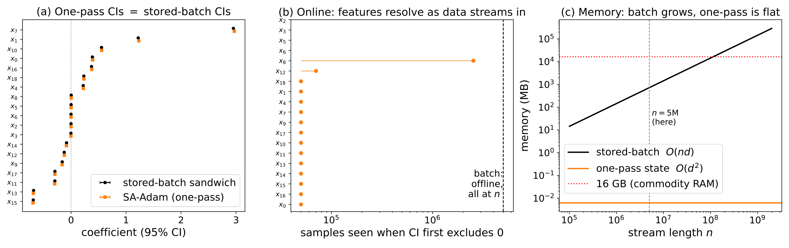

# One-Pass Streaming Inference with Adam
### A Polyak–Ruppert Central Limit Theorem Where Adaptivity Is Invisible

**Sunyoung An** and **Xiaoming Huo** — H. Milton Stewart School of Industrial and Systems
Engineering, Georgia Institute of Technology.

Reproduction code for the 12-page applied paper accompanying
[arXiv:2606.17364](https://arxiv.org/abs/2606.17364). The manuscript is not
included here while it is under review; it will be posted once review is complete.



*One pass over the 5,000,000-example SUSY stream recovers the stored-batch
confidence intervals (left), resolves each coefficient's significance as data
arrives (centre), and holds flat `O(d²)` state while the stored design grows past
commodity RAM (right).*

### Quick start

The cached results are committed, so both expensive figures redraw in **under a
minute** — no simulation, no data download:

```bash
cd sim
pip install -r requirements.txt
python exp1_theory_fused.py          # Figure 1  (~1 min)
python exp3_coverage.py --replot     # Figure 2  (seconds)
```

Reproducing Figure 3 needs the SUSY download; see [Data you need](#data-you-need).

---

## What the paper shows

Adam and AdamW — adaptive preconditioning plus momentum — are the workhorses of
large-scale learning. Under Polyak–Ruppert averaging, can they double as one-pass
engines for streaming statistical inference, delivering calibrated confidence
intervals in a single pass? The answer is **yes**: the averaged-iterate covariance
is exactly the plain-SGD sandwich `H⁻¹SH⁻¹` — adaptivity and momentum are
*asymptotically invisible* — established via a non-autonomous Polyak–Ruppert CLT
and a **projection identity**, for a stochastic-approximation reparametrization of
Adam (SA-Adam) with sub-linearly decaying momentum (`γ < 1`, which we show is
necessary), and extended to ridge-regularized inference.

The deliverable is `Algorithm 1`: one pass over the stream, `O(d²)` state,
coordinatewise Wald intervals out — no second pass, no stored design matrix, no
oracle covariance.

**Results.**

* **Adaptivity really is invisible.** The projection identity — iterate-marginal
  covariance equal to the plain-SGD sandwich — is verified numerically to relative
  error 1.6×10⁻¹⁵ across 10³ random non-commuting `(P, ρ, τ)` (Exp 1).
* **Sub-linear momentum is necessary, not cosmetic.** At the boundary `γ = 1` the
  asymptotic variance inflates roughly fourfold and the sandwich limit fails
  (Exp 2).
* **The intervals are calibrated.** Joint 95% Wald coverage reaches nominal by
  n ≈ 10⁶ (0.951, oracle and plug-in alike) and holds to n = 10⁸ (Exp 3).
* **It scales.** A single pass over the 5×10⁶-example SUSY stream recovers the
  full-data ℓ2-logistic solution to 0.6% relative error and its interval
  half-widths to 1.1%, holding only `O(d²)` state — a ~10⁵× memory reduction over
  storing the design (Exp 4).

---

## Repository layout

```
.
├── sim/                    Experiment code (one self-contained file per experiment)
│   ├── exp1_projection_clt.py        Exp 1 simulation (the expensive one)
│   ├── exp1_theory_fused.py          → Figure 1  (renders from Exp 1's cache)
│   ├── exp2_gamma_necessity.py       Exact V(γ) table (supporting; no paper figure)
│   ├── exp3_coverage.py              → Figure 2
│   ├── exp4_streaming_logistic.py    → Figure 3
│   ├── prepare_susy.py               Builds the SUSY cache used by Exp 4
│   └── requirements.txt              Pinned environment
└── figs/                   Paper figures + cached raw outputs and summary tables
```

Every script in `sim/` is **self-contained**: no shared project module, no import
of another experiment. Each writes its outputs to `../figs/`.

### Script → figure map

| Paper | Script | Output |
|---|---|---|
| Figure 1 (§6.1) — adaptivity is invisible; `γ<1` is necessary | `exp1_projection_clt.py` → `exp1_theory_fused.py` | `figs/exp1_theory_fused.pdf` |
| Figure 2 (§6.2) — oracle-free coverage on real covariates | `exp3_coverage.py` | `figs/exp3_coverage.pdf` |
| Figure 3 (§6.3) — one pass vs. stored batch at scale (SUSY) | `exp4_streaming_logistic.py` | `figs/exp4_streaming_logistic.pdf` |
| §6.1 boundary values `V(γ)`, `V(1)=4.33` (no figure) | `exp2_gamma_necessity.py` | `figs/exp2_gamma_necessity_values.csv` |

Figure 1 is drawn by `exp1_theory_fused.py`, which runs **no** simulation: it loads
the cached raw iterates written by `exp1_projection_clt.py`
(`figs/exp1_projection_clt_raw.npz`, shipped here) and evaluates the exact scalar
variance recursion itself. `exp2_gamma_necessity.py` is the standalone version of
that same exact recursion; it is included because it is the source of the `γ = 1`
boundary numbers quoted in §6.1, but it is not needed for any figure.

---

## Python environment

Python **3.13**, four core packages (plus scikit-learn for the Exp 3 covariates).
Versions are pinned to those that produced the reported numbers; with the fixed
seeds in each script the runs are deterministic, so the pins reproduce the paper's
values exactly.

```bash
cd sim
python -m venv .venv && source .venv/bin/activate
pip install -r requirements.txt
```

```
numpy==2.4.4        scipy==1.17.1        matplotlib==3.10.8
numba==0.65.0       scikit-learn==1.8.0
```

`numba` does the heavy lifting — the per-step recursions are JIT-compiled, and
Exp 1 is `prange`-parallel over independent streams. `prepare_susy.py` optionally
uses `pandas` (only to parse the SUSY CSV quickly); it falls back to a chunked
numpy parse if pandas is absent.

Notes on parallelism: Exp 1 takes `--threads` (numba threads); Exp 3 uses
`multiprocessing` with `--cores` and pins BLAS to one thread per worker, so
`--cores k` really uses about `k` cores. Both default to 7.

---

## Data you need

| Experiment | Data | Where it comes from | Action needed |
|---|---|---|---|
| Exp 1, Exp 2 | none — fully synthetic | Gaussian covariates on a Toeplitz Hessian (`d=20`), simulated in-script | none |
| Exp 3 | real covariates, simulated response | `diabetes` bundled **inside scikit-learn** (`sklearn.datasets.load_diabetes`) | none — no network access, no download |
| Exp 4 | **SUSY** (`n = 5,000,000`, 18 features, real labels) | UCI Machine Learning Repository | download + convert (below) |

**Exp 3 detail.** Real `diabetes` feature matrix, standardized, with the two
near-collinear serum features (`s1`, `s4`) dropped and an intercept added
(`d = 9`, `cond(H) ≈ 7.5`). The *response* is simulated with known
heteroskedastic noise, so `x*, H, S, Σ = H⁻¹SH⁻¹` are exact and Wald coverage can
be checked against ground truth — the point of the semi-synthetic design.

**Exp 4 setup (the only download).** SUSY is not redistributed here (~2.4 GB
uncompressed, ~900 MB gzipped):

```bash
# 1. get the file (≈900 MB) from the UCI repository
curl -O https://archive.ics.uci.edu/ml/machine-learning-databases/00279/SUSY.csv.gz
#    landing page: https://archive.ics.uci.edu/dataset/279/susy

# 2. convert to the cache the experiment expects (default: /tmp/susy.npz)
python sim/prepare_susy.py --csv SUSY.csv.gz

# 3. run
python sim/exp4_streaming_logistic.py
```

`exp4_streaming_logistic.py` reads the path in its module constant `SUSY_NPZ`
(`/tmp/susy.npz`); write the cache elsewhere with `prepare_susy.py --out ...` and
edit that one line to match. The cache holds `X` (5,000,000 × 18, **UCI column
order** — 8 low-level kinematic features then 10 high-level discriminants) and
`y` (the label). The script standardizes `X` and prepends the intercept itself,
so the coefficient ordering in Figure 3 is exactly the UCI feature order. A
no-download alternative is `--dataset covtype`, which pulls `covtype` through
scikit-learn instead (a sanity path, not the paper's run).

---

## Reproducing the figures

The `figs/` folder already contains the cached raw outputs, so **both expensive
figures redraw in under a minute** without rerunning any simulation:

```bash
cd sim
python exp1_theory_fused.py          # Figure 1, from exp1_projection_clt_raw.npz  (~1 min)
python exp3_coverage.py --replot     # Figure 2, from exp3_coverage_replot.npz     (seconds)
```

Full runs, at the settings that produced the paper (all defaults):

```bash
python exp1_projection_clt.py                 # n=1e8, M=200, 7 threads  (~40 min)
python exp1_theory_fused.py                   # then redraw Figure 1
python exp3_coverage.py                       # n=1e8, M=1000, 7 cores   (the longest run: budget hours)
python exp4_streaming_logistic.py             # one pass over SUSY       (minutes, after the cache exists)
python exp2_gamma_necessity.py                # exact V(γ) table         (~5-6 min)
```

Fast smoke checks that never overwrite the publication figures:

```bash
python exp1_projection_clt.py --n 1000000 --M 200 --check
python exp1_projection_clt.py --pcheck        # exact projection-identity check over
                                              # 10^3 random non-commuting (P, ρ, τ); instant
python exp3_coverage.py --check               # n=1e4, M=200 → *_check outputs
python exp3_coverage.py --n 1000000 --tag _n1e6
```

### Cached artifacts in `figs/`

| File | Size | What it is |
|---|---|---|
| `exp1_projection_clt_raw.npz` | 10 MB | Exp 1 raw iterates (5 arms × 200 streams × 5 checkpoints × d=20) + per-stream `H`, `S`; **required** by `exp1_theory_fused.py` |
| `exp3_coverage_replot.npz` | 8.6 MB | Exp 3 per-replication intervals and plug-in covariances; enables `--replot` |
| `exp1_theory_fused_vcurve.npz` | 1 KB | Cached exact `V(γ)` curve (recomputed automatically if absent) |
| `*_summary.csv` | small | The per-`n` summary tables behind the numbers quoted in §6 |

---

## Data licensing and attribution

Nothing in this repository redistributes third-party data — Exp 1 and 2 are
synthetic, Exp 3's covariates ship inside scikit-learn, and SUSY is downloaded by
the user from UCI. For completeness:

- **SUSY** — UCI Machine Learning Repository, donated by Baldi, Sadowski &
  Whiteson, *Searching for exotic particles in high-energy physics with deep
  learning*, **Nature Communications** 5:4308 (2014).
  UCI repository datasets are made available under the **Creative Commons
  Attribution 4.0 International (CC BY 4.0)** license, which permits use and
  redistribution (including commercial) with attribution. This repository cites
  the donors' paper and links to the source rather than mirroring the file.
- **diabetes** — the standard Efron, Hastie, Johnstone & Tibshirani (2004,
  *Annals of Statistics*, "Least Angle Regression") dataset, distributed as a
  bundled dataset inside **scikit-learn** (BSD-3-Clause). It is a small, long-
  public teaching dataset carrying no usage restriction, and it is *not* copied
  here — it arrives with the `scikit-learn` install.
- **Code** — the experiment scripts in `sim/` are original work by Sunyoung An and
  are released under the **MIT License** (see [`LICENSE`](LICENSE)): free to use,
  modify, and redistribute, including commercially, provided the copyright notice
  is retained.
- **Figures** — © 2026 Sunyoung An. The MIT grant covers the code only; the
  figures are included for reference and are not separately licensed for
  redistribution. The manuscript itself is not distributed here (see the top of
  this README).

No dataset used here contains personal or identifying information: SUSY is
simulated particle-collision data, and the `diabetes` covariates are the
long-published, de-identified, standardized LARS benchmark.

---

## Citation

```bibtex
@unpublished{an2026onepass,
  author = {An, Sunyoung and Huo, Xiaoming},
  title  = {One-Pass Streaming Inference with Adam: A {Polyak--Ruppert}
            Central Limit Theorem Where Adaptivity Is Invisible},
  year   = {2026},
  note   = {Manuscript under review}
}
```
